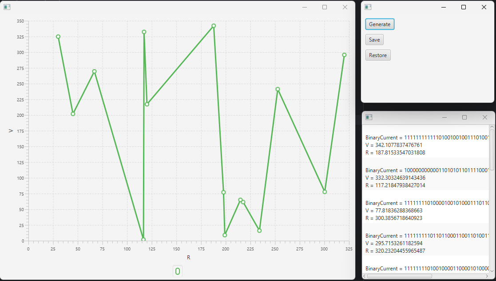

## Завдання

1. Розробити ієрархію класів відповідно до шаблону Observer (java) та продемонструвати можливість обслуговування розробленої раніше колекції (об'єкт, що спостерігається, Observable) різними (не менше двох) спостерігачами (Observers) – відстеження змін, упорядкування, висновок, відображення і т.д.
2. При реалізації ієрархії класів використати інструкції (Annotation). Відзначити особливості різних політик утримання анотацій (annotation retention policies). Продемонструвати підтримку класів концепції рефлексії (Reflection).
3. Використовуючи раніше створені класи, розробити додаток, що відображає результати обробки колекції об'єктів у графічному вигляді
4. Забезпечити діалоговий інтерфейс з користувачем та перемальовування графіка під час зміни значень елементів колекції.

### Робота програми

